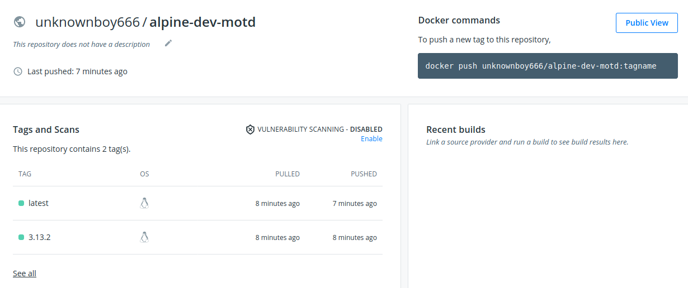
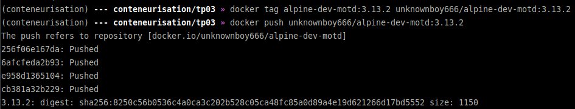

# Conteneurisation M2 TP03

## Initiation au Docker Hub

* Docker hub link --> https://hub.docker.com/repository/docker/unknownboy666/alpine-dev-motd
* Proof Docker Hub

* Commands
```bash
(conteneurisation) --- conteneurisation/tp03 » docker login 
Login with your Docker ID to push and pull images from Docker Hub. If you don't have a Docker ID, head over to https://hub.docker.com to create one.
Username: unknownboy666
Password: 
WARNING! Your password will be stored unencrypted in /home/gabyf/.docker/config.json.
Configure a credential helper to remove this warning. See
https://docs.docker.com/engine/reference/commandline/login/#credentials-store

Login Succeeded
(conteneurisation) --- conteneurisation/tp03 » docker tag alpine-dev-motd:3.13.2 unknownboy666/alpine-dev-motd:3.13.2
(conteneurisation) --- conteneurisation/tp03 » docker images unknownboy666/alpine-dev-motd:3.13.2
REPOSITORY                      TAG                 IMAGE ID            CREATED             SIZE
unknownboy666/alpine-dev-motd   3.13.2              91f012ccb922        25 minutes ago      5.62MB
(conteneurisation) --- conteneurisation/tp03 » docker push unknownboy666/alpine-dev-motd:3.13.2                   
The push refers to repository [docker.io/unknownboy666/alpine-dev-motd]
256f06e167da: Pushed 
6afcfeda2b93: Pushed 
e958d1365104: Pushed 
cb381a32b229: Pushed 
3.13.2: digest: sha256:8250c56b0536c4a0ca3c202b528c05ca48fc85a0d89a4e19d621266d17bd5552 size: 1150
```
* Proof

